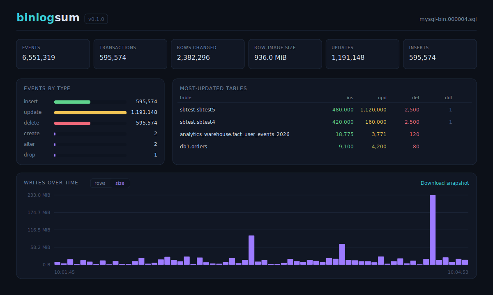

# 🐬 binlogsum 🦭

**A detailed summary tool for MySQL / MariaDB binary logs.**

`binlogsum` reads the decoded output of `mysqlbinlog` and produces a rich
summary of what a binary log actually contains — time frame, server flavor and
version, per-`server_id` event counts, GTID and Xid ranges, a tally per query
type, the most-updated tables, and per-transaction metadata — then renders a
*writes-over-time* histogram either as a styled terminal report or an
interactive web UI.

It is pure Go standard library: no third-party modules, builds offline, single
static binary.



> The image above is a schematic of the web UI. For a **live, interactive
> example**, download [`docs/example-snapshot.html`](https://raw.githubusercontent.com/PrzemekMalkowski/binlogsum/refs/heads/main/docs/example-snapshot.html)
> and open it in a browser — it is a self-contained snapshot produced by
> `binlogsum --mode snapshot` (drag on the histogram to zoom, click a row for
> details, sort the table columns).

## Why

`mysqlbinlog` decodes a binary log, but it doesn't tell you the shape of it:
how big each transaction is, which tables took the most writes, when the write
spikes happened, or what DDL ran. `binlogsum` answers those questions, which is
handy when investigating replication lag, bloated transactions, or "what on
earth happened to this server between 10:00 and 10:05".

## Install

```sh
git clone https://github.com/PrzemekMalkowski/binlogsum.git
cd binlogsum
go build -o binlogsum .
# optionally: go install .
```

Requires Go 1.21+.

## Usage

Feed it the decoded text from `mysqlbinlog`, via a pipe or `--file`:

```sh
# stream straight from mysqlbinlog
mysqlbinlog --base64-output=DECODE-ROWS -v mysql-bin.000123 | binlogsum

# or from a saved decoded file
mysqlbinlog --base64-output=DECODE-ROWS -v mysql-bin.000123 > decoded.log
binlogsum --file decoded.log
```

Works with **ROW** format (both `binlog_row_image=FULL` and `MINIMAL`) and with
**STATEMENT** format. For STATEMENT-format transactions, per-transaction byte
size is not measured (there are no row images to bound it).

### Modes

```sh
binlogsum --mode text                          # default; styled terminal report
binlogsum --mode web                           # interactive zoomable UI
binlogsum --mode snapshot --out report.html    # self-contained interactive HTML
```

- **text** — a one-shot colored report with a Unicode-block histogram.
- **web** — serves an interactive UI: drag on the histogram to zoom to a time
  window, toggle rows vs size, click a transaction for full details, sort the
  per-table and per-transaction columns, and download a snapshot.
- **snapshot** — writes the entire interactive UI with the data embedded into a
  single HTML file (no server needed) — good for attaching an analysis to a
  ticket or sharing it. The default download name is derived from the source
  binlog name.

### Options

```
-f, --file PATH     read decoded binlog from PATH (default: stdin)
-m, --mode MODE     output mode: text (default), web, or snapshot
    --addr ADDR     web mode listen address (default 127.0.0.1:8080)
-o, --out PATH      snapshot mode output file (default: stdout)
    --buckets N     histogram buckets in text mode (default 60)
    --top N         tables shown in the "most-updated" list (default 10)
    --no-color      disable ANSI colors in text mode
-v, --version       print version and exit
-h, --help          show help
```

## Example summary report (text mode)

```
━━━━━━━━━━━━━━━━━━━━━━━━━━━━━━━━━━━━━━━━━━━━━━━━━━━━━━━━━━━━━━━━━━━━━━━━━━━━━━
 binlogsum 0.1.0   source: stdin
━━━━━━━━━━━━━━━━━━━━━━━━━━━━━━━━━━━━━━━━━━━━━━━━━━━━━━━━━━━━━━━━━━━━━━━━━━━━━━
  time frame       2026-06-22 23:12:01  →  2026-06-22 23:14:01  (2m 0s)
  server           MySQL 8.4.7-7
  events           199217 total
  transactions     6144
  server ids       20108 (199217 ev)
  gtid range       00020108-1111-1111-1111-111111111111:270183  →  00020108-1111-1111-1111-111111111111:276326
  xid range        5493  →  198600
  rows changed     116,957
  row-image size   40.3 MiB

┃ events by type
  insert    █████████████··············· 37,764
  update    ████████████████████████████ 76,253
  delete    █··························· 2,940
  alter     █··························· 2

┃ most-updated tables
  table                      ins       upd       del       ddl
  sysbench.order_line7     3,750     4,329         0         0
  sysbench.order_line2     3,825     3,935         0         0
  sysbench.order_line8     3,738     3,688         0         0
  sysbench.order_line4     3,665     3,515         0         0
  sysbench.order_line5     3,403     3,721         0         0
  sysbench.order_line3     3,644     3,478         0         0
  sysbench.order_line6     3,592     3,530         0         0
  sysbench.order_line1     3,435     3,309         0         0
  sysbench.stock2              0     3,825         0         0
  sysbench.stock7              0     3,750         0         0
  sysbench.stock8              0     3,738         0         0
  sysbench.stock4              0     3,665         0         0
  sysbench.stock3              0     3,644         0         0
  sysbench.stock6              0     3,592         0         0
  sysbench.stock1              0     3,435         0         0
  sysbench.stock5              0     3,403         0         0
  sysbench.customer7           0       803         0         0
  sysbench.new_orders7       372         0       420         0
  sysbench.orders7           372       420         0         0
  sysbench.customer5           0       781         0         0

┃ writes over time
  rows      █▆██▁ ▁▄▄▄▄▁    ▃▄▄▄▄             ▃▄▄  ▁▄▄▃       ▃▄▄     peak 9,339
  size      ▇▅▇█▁ ▁▄▄▄▄▁    ▃▄▄▄▄             ▃▄▄   ▄▄▃       ▃▄▄     peak 3.4 MiB
       23:12:01                                            23:14:01
  60 buckets across the log window

```
## What it reports

Header / overview: time frame, server flavor and version, event count per
`server_id`, GTID range, Xid range, total events and a per-query-type tally
(INSERT / UPDATE / DELETE / CREATE / ALTER / DROP / TRUNCATE / RENAME), and the
most-updated tables sorted by rows changed.

Per transaction: byte size (delta between the `# at` position after `BEGIN` and
after `COMMIT`), tables involved, rows inserted/updated/deleted, DDL kind and
table, and timestamps. DDL statements are surfaced as their own entries so they
are searchable in the web UI.

## Build & test

```sh
go test ./...
go build -o binlogsum .
```

No third-party modules — it builds offline.

## License

`binlogsum` is licensed under the **GNU General Public License v3.0 or later**
(`GPL-3.0-or-later`). See [`LICENSE`](LICENSE) for details.

> The `LICENSE` file ships the standard GPLv3 notice; before publishing, drop in
> the full verbatim license text:
> `curl -fsSL -o LICENSE https://www.gnu.org/licenses/gpl-3.0.txt`
